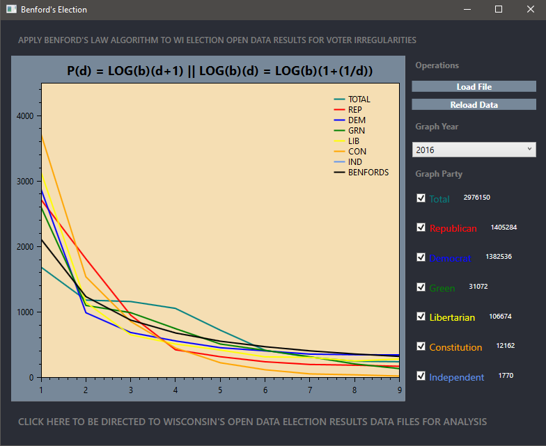
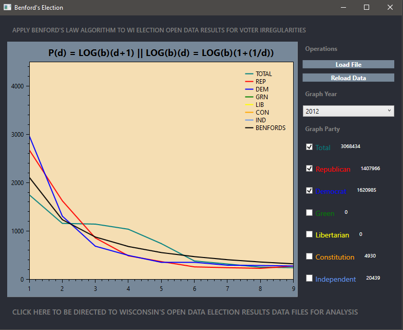

# BENFORDS_ELECTION
Applying Benford's Law To Wisconsin Open Elections Data

# tldr 
[Release 1.0 Download](https://github.com/michaelrinderle/BENFORDS_ELECTION/releases/download/R1.0/Benfords.Election.1.0.zip)

# program notes

This application takes open records data from the LTSB Open Data page to retrieve election
data from every precinct in Wisconsin for the general elections. If you are not aware of 
[Benford's Law](https://en.wikipedia.org/wiki/Benford%27s_law), it is an algorithm that is 
used to determine anonomalies in number distribution. This takes the vote totals for all
candidates and each one taking the total's lead digit and distributing in into an array
that mimics the 1-9 value distribution. It will then determine the Benford curve depending
on the number of precincts so give you relation to party vote distributions for spotting
anonmalies. Grab WI OPEN RECORDS VOTER DATA [HERE](https://data-ltsb.opendata.arcgis.com/datasets/2012-2018-election-data-with-2020-wards)

# features

* .NET Core WPF Application 
	* Apply Benford's Law to 2012, 2016, & 2020 WI Presidential Elections
	* Select one or multiple parties to analyze voting distributions.
  * OxyPlot Graphs

